# sentry-source-engine
This repository contains the files needed to implement Sentry to the Source engine. This code was published in hope that this could help sourcemodders track the player's session incase of crashing.

## How do I add this into my sourcemod?
Here's the list of things you require before you continue on this tutorial:
- A existing Sentry project (see https://docs.sentry.io/product/sentry-basics/integrate-frontend/create-new-project on how to create a project)
- Source SDK 2013 code (duh)
- Visual Studio Community/Professional 2013 (you can download it here: https://archive.org/details/en_visual_studio_community_2013_with_update_5_x86_dvd_6816332)

***WARNING!!!!!!!!!!!!!!!!!!!!!!!!!!!!!!*** \
This implemention was only tested in Source SDK 2013 CE. Meaning that a later version of Visual Studio and buildtools was used in implementing Sentry. For the love of god, just please DM me on Discord (jeff.hm_.) if it actually works on the original codebase

---

Anyways, back to the tutorial. \

### STEP 1
First, you need to download the sentry-source-engine which is this repository you're on right now. You can download it as a archive or clone it using Git.

### STEP 2
Copy the contents of the `src` directory to your mod's source code one. \
***You can place the `sentry_native` folder anywhere in the source code you want but the Sentry manager code (rw_sentry_manager.cpp & rw_sentry_manager.h) needs to be placed on the `src/game/shared` folder!***

### STEP 3
Edit your mod's client and server VPC script (client_hl2mp.vpc, server_hl2mp.vpc, etc.) \
On the client side, add the path to your sentry_native's `include` folder as a additional include directory.
For example:
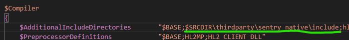
 
 
Now on the `Project` part, add the path to your sentry_native's `sentry.lib` file as a Link Library.
For example:
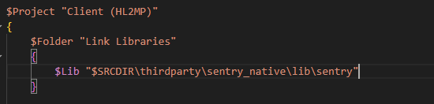 \

Do the same for the server side. \
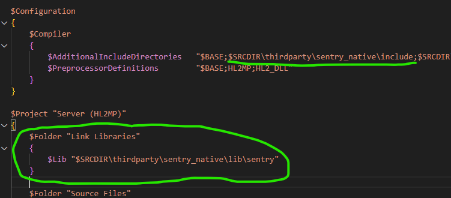

(there's no need to do this as you can add additional include directories and libraries through Visual Studio itself but i'm too lazy to screenshot it)

### STEP 4
Now, run the `creategameprojects.bat` script. This will create a Visual Studio solution file to build your mod.
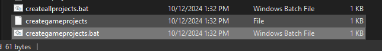 \
Once the solution file has been created, open it with Visual Studio 2013.
By default, the solution file name is `games.sln`. \

### STEP 5
Once you have opened the solution, there is one thing to do before compiling. \
First, right click the solution and then click `Properties`. \
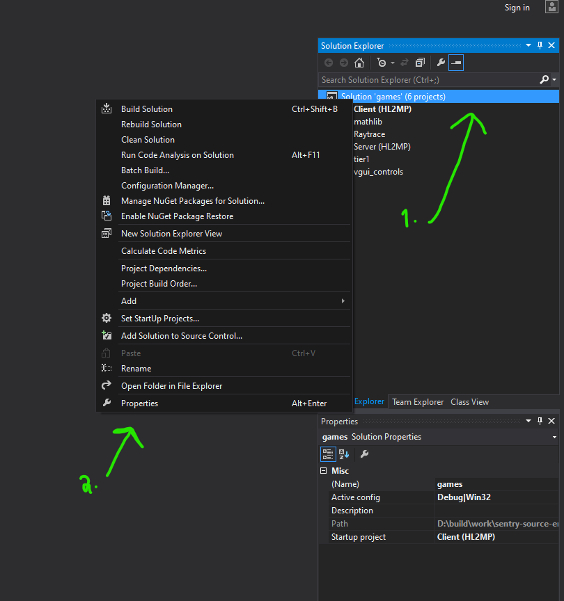 \
 
 
Navigate to the `Configuration Properties` and set the `Configuration` to `Release`. \
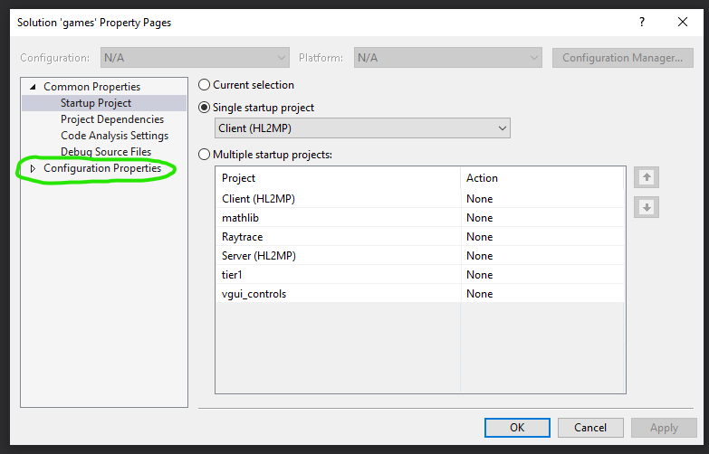 \
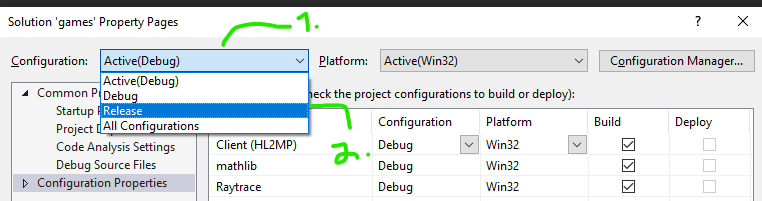 \
Once you did that, click on `OK` at the bottom of the window. \
 
 
Now, time to add the Sentry manager code. \
Navigate to any project, right-click the `Source Files` folder and click on `Add`. \
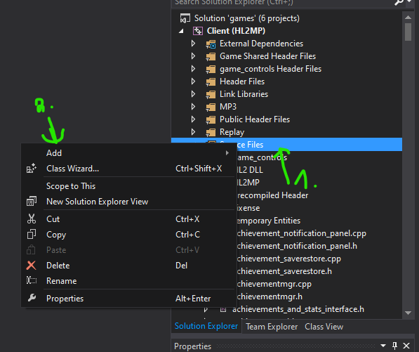 \
Click on `Existing Item`. \
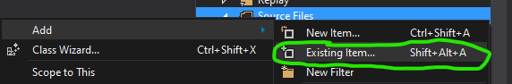 \
This dialog will appear. Navigate to the `shared` folder (located in `src/game/shared`). \
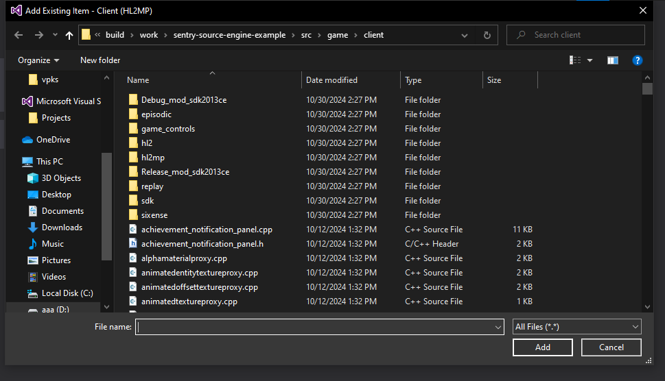 \

Now, find and select both `rw_sentry_manager.cpp` and `rw_sentry_manager.h` files then click on `Add`.
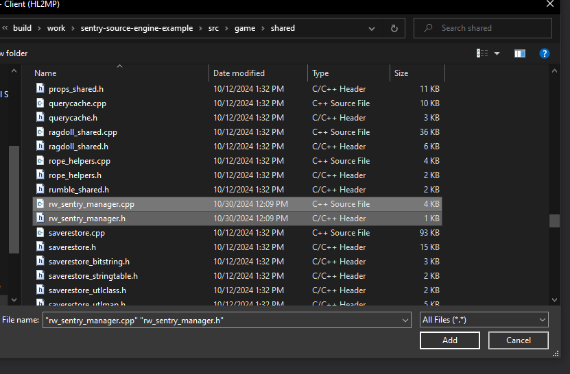

### STEP 6
Once you have both of the source files added, let's edit something on `rw_sentry_manager.cpp`. \
Go to around line 32 and replace the URL (underlined with the green color) with your Sentry project's DSN link (see https://docs.sentry.io/concepts/key-terms/dsn-explainer/#where-to-find-your-dsn on where to get your project's DSN link).
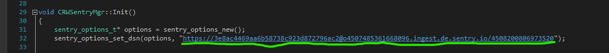 \
Now, on to the main part. \
Open up `cdll_client_int.cpp` (it's located in your Client project)\
After the `#ifdef` for `WORKSHOP_IMPORT_ENABLED`, add `#include "rw_sentry_manager.h"` \
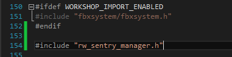 

Navigate to `CHLClient::Init` and add `RWSentryMgr()->Init();` after an another `#ifdef` for `WORKSHOP_IMPORT_ENABLED` \
It should look something like this: \
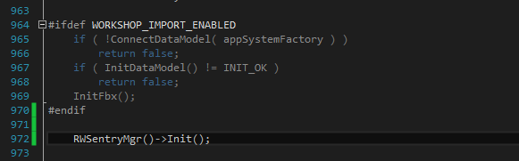 

Navigate to `CHLClient::Shutdown` and add `RWSentryMgr()->Shutdown();` after an yet another `#ifdef` for `WORKSHOP_IMPORT_ENABLED` \
It should look something like this: \
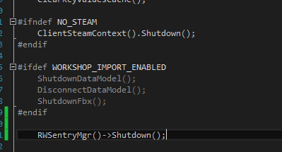

On to the server-side. 

Open up `gameinterface.cpp` (it's located in your Server project)\
After the `#if defined()` for `REPLAY_ENABLED`, add `#include "rw_sentry_manager.h"` \
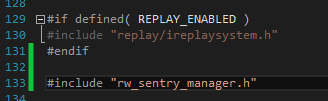

Navigate to `CServerGameDll::DllInit` and add `RWSentryMgr()->Init();` after the `factorylist_t` bullshit \
It should look something like this: \
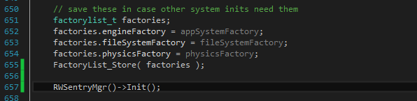 

Navigate to `CServerGameDll::DllShutdown` and add `RWSentryMgr()->Shutdown();` after the Steam API context shuts down \
It should look something like this: \
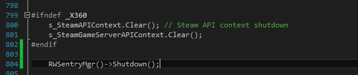

Now, build your mod's code! \
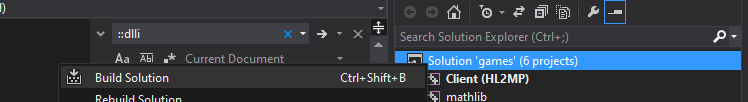

### STEP 7
Once it's finished building, navigate to the directory where you putted the `sentry_native` folder earlier and copy all the contents of `sentry_native`'s `bin` folder to your mod's `bin` folder (the `.pdb` files will be useful when debugging). \
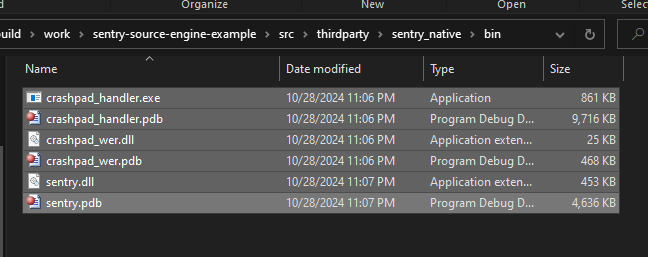 

Your mod's `bin` folder should look like this: \
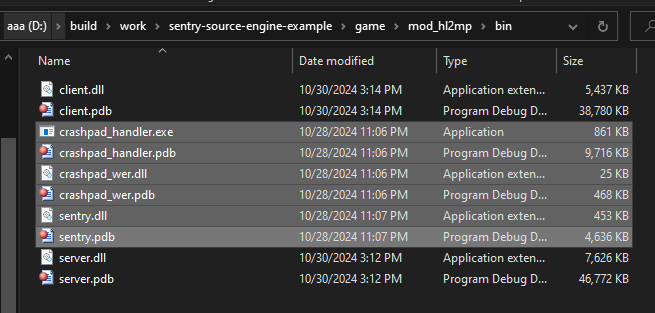

Now, run your mod! \
If you see those log messages with `[ Sentry ] -` at the beginning in your developer console \
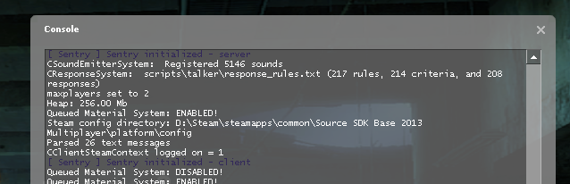 \
and `crashpad_handler.exe` running alongside of `hl2.exe`, that means Sentry is working! \
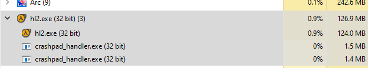

---

There you go! That's how you implement Sentry into your Source 2013 mod!
